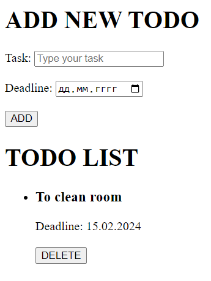
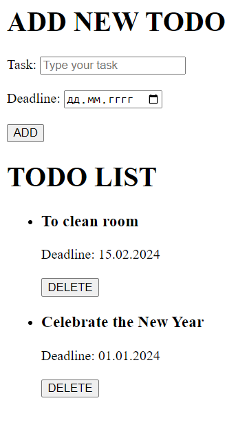

# CouchDB: Загальні відомості та використання на практиці

## Що таке CouchDB?

**CouchBD** - це документоорієнтована NoSQL система управління базами даних з відкритим вихідним кодом. Написана на мові програмування **Erlang**. Виходячи з підходу NoSQL, CouchDB не зберігає дані та зв'язки в таблицях. Натомість кожна база даних — набір незалежних документів. Кожен документ містить власні дані та незалежну схему. Програма може отримати доступ до кількох баз даних, наприклад, що зберігається на мобільному телефоні користувача та на сервері. Метадані документа містять інформацію про версію, дозволяючи об'єднувати дані та вирішувати будь-які суперечності, які могли з'явитися в момент, коли бази даних були роз'єднані. Основною особливістю цієї СУБД серед інших є те, що для збереження даних використовується **JSON**. 

## Основні особливості та переваги CouchDB

CouchDB поставляється з широким набором функцій, розроблених для зниження затрат при роботі зі стійкою розподіленою системою. Ось деякі ключові особливості та переваги CouchDB, які відрізняють її від інших NoSQL баз даних.

### Реплікація

 Однією з визначальних особливостей CouchDB є **двонаправлена реплікація**, яка дозволяє синхронізувати дані між кількома серверами та пристроями. Ця реплікація дозволяє підприємствам максимізувати доступність систем, скоротити час відновлення даних, геолокувати дані, найближчі до кінцевих користувачів, і спростити процеси резервного копіювання. У CouchDB немає різниці, чи зберігаються дані на одному сервері або на декількох. Скоріше, CouchDB ідентифікує зміни в документах, коли вони відбуваються з будь-якого джерела, і гарантує, що всі копії бази даних залишаються синхронізованими з найновішою інформацією. Це дозволяє декільком реплікам баз даних бути самодостатніми та керованими, зберігаючи при цьому точну інформацію в режимі реального часу в кількох обчислювальних середовищах.

### Views 

 CouchDB використовує так звані представлення **(views)** як основний інструмент для виконання запитів і створення звітів зі збережених файлів документів. Views дають змогу фільтрувати документи для пошуку відомостей, пов'язаних із певним процесом бази даних. Потім цю інформацію можна зіставити відповідно до ваших уподобань і витягти в певному порядку. Одна з найбільших переваг CouchDB полягає в свободі представлення інформації. Оскільки View в CouchDB будується динамічно і не впливає безпосередньо на будь-які базові сховища документів, немає обмежень на кількість навіть однакових view , які ви можете запустити. Ці view створюються всередині спеціальних проектних документів і можуть бути відтворені в кількох екземплярах бази даних, як звичайні збережені дані. Ще однією чудовою особливістю CouchDB є доступність MapReduce. Представлення (views) в CouchDB можуть здійснювати агрегацію узагальнення даних, що зберігаються в індексі. Вони попередньо обчислюються та зберігаються, тобто їх можна миттєво повернути, навіть у мільярдах документів.

### HTTP API
 
 CouchDB використовує REST API для доступу до бази даних з будь-якого місця, з повною гнучкістю операцій **CRUD** (створення, читання, оновлення, видалення). Цей простий та ефективний засіб підключення до баз даних робить CouchDB гнучким, швидким та потужним у використанні, залишаючись при цьому високодоступним.

### Зберігання документів
 
 У CouchDB документи **JSON** є основними одиницями даних, поряд з пов'язаними з ними двійковими вкладеннями, такими як зображення. Немає  обмежень на розмір тексту або кількість елементів кожного документа. Після реплікації дані можуть бути доступні та оновлені в глобально  розподілених кластерах серверів.

### Сумісність
 
 CouchDB є надзвичайно доступним і пропонує різноманітні переваги сумісності. CouchDB був написаний на **Erlang** (універсальна, паралельна, мова програмування з валсними системами збору сміття **(garbage-collector)** та виконання **(runtime)**), що робить її надійною та простою у роботі для розробників. HTTP-клієнти доступні для всіх мов програмування, а також для специфічних для CouchDB клієнтських бібліотек. CouchDB є гнучким і може бути встановлений і запущений на багатьох операційних системах і інструментах віртуалізації.

### Масштабованість
 
 Архітектурний дизайн CouchDB робить його надзвичайно адаптивним при розбитті баз даних і масштабуванні даних на кілька вузлів. CouchDB підтримує як горизонтальне розбиття на розділи, так і реплікацію, щоб створити легко кероване рішення для балансування навантажень як читання, так і запису під час розгортання бази даних. CouchDB має дуже міцний і надійний механізм зберігання даних, який був створений з нуля для мультихмарних інфраструктур і інфраструктур з декількома базами даних. Як NoSQL база даних, CouchDB дуже гнучко налаштовується і відкриває двері для розробки різних додатків, незалежно від обсягу даних або кількості користувачів.

### Відкритий вихідний код
 
 Завдяки своїй сильній підтримці в спільноті з відкритим вихідним кодом, CouchDB підтримує міцну, надійну основу для управління корпоративними базами даних. Розроблений протягом декількох років як рішення без схем, CouchDB пропонує безпрецедентну гнучкість, яку просто неможливо знайти в більшості пропрієтарних рішень для баз даних.

## Робота з CouchDB на реальному прикладі

Отже, тепер настав час перейти від теоретичних відомостей до використання цієї СУБД при створенні цілком конкретного веб-застосунку. Для прикладу я вирішив продемострувати створення списку справ **(TODO list)** з можливістю додавати та видаляти записи.

### Завантаження та первинне налаштування

Для початку потрібно встановити на свій пристрій службу **Apache CouchDB**. Зробити це можна через офіційний сайт: https://couchdb.apache.org

Після завершення інсталяції варто переконатися чи працює встановлена служба:

<p align="center">
    
</p>

Тепер можемо відкрити налаштування нашої СУБД, для цього в браузері вводимо наступну адресу: http://localhost:5984/_utils і бачимо приблизно таке меню:

<p align="center">
    
</p>

Тут я завчасно заготував базу даних, а в ній один документ:

<p align="center">
    
</p>

А також View для отримання всіх документів за полем _id:

<p align="center">
    
</p>

### Реалізація веб-застосунку

Отже, з базою даних та її початковими налаштуваннями розібралися, тепер перейдемо до реалізації нашого веб-застосунку. Для його створення я буду використовувати наступні інструменти та технології:

- Фреймворк **Express.js** для створення серверу

- Програмне забезпечення **body-parser** для обробки запитів

- Пакет **node-couchdb** для роботи з базою даних

- Мова шаблонів **EJS (Embedded JavaScript templates)** для генерації HTML розмітки за допомогою JavaScript

Тепер перейдемо до коду. Я створив 3 файли з розширенням .js та один з роширенням .ejs. Давайте розглянемо по порядку який код я вписав у кожен з файлів:

- `app.js`

```js
'use strict';

const express = require('express');
const bodyParser = require('body-parser');
const path = require('path');
const routes = require('./routes');

const app = express();

app.set('view engine', 'ejs');
app.set('views', path.join(__dirname, 'views'));

app.use(bodyParser.json());
app.use(bodyParser.urlencoded({extended: false}));

app.use('/', routes);

app.listen(3000, () => console.log('Server started on port 3000'));
```

У цьому файлі я створюю новий додаток Express, налаштовую його для використання EJS в якості рушія представлень, також налаштовую його для використання body-parser, задля обробки JSON об'єктів у запитах, ще я тут підключаю шляхи (routes), які розписав у іншому файлі, і, нарешті, запускаю сервер на порту 3000

- `db.js`

```js
'use strict';

const nodeCouchDB = require('node-couchdb');

require('dotenv').config();

const couch = new nodeCouchDB({
    auth: {
        user: process.env.DB_USER,
        pass: process.env.DB_PASS
    }
});

module.exports = couch;
```

У цьому файлі я створюю новий езкемпляр nodeCouchDB, в якому передаю об'єкт з обліковими даними для аутентифікації в Apache CouchDB, цей екземпляр я експортую для подальшого використання. Облікові дані я беру з файлу .env для забезпечення кращого захисту чутливої інформації

- `routes.js`

```js
'use strict';

const express = require('express');
const router = express.Router();
const couch = require('./db.js');

require('dotenv').config();

const dbName = process.env.DB_NAME;
const viewUrl = process.env.VIEW_URL

router.get('/', (req, res) => {
  couch.get(dbName, viewUrl).then(
      (data, headers, status) => res.render('index', { todos: data.data.rows }),
      err => res.send(err)
)
});

router.post('/todo/add', (req, res) => {
    const business = req.body.business;
    const date = req.body.date.split('-');

    couch.uniqid().then(ids => {
        const id = ids[0];

        couch.insert(dbName, {
            _id: id,
            business: business,
            deadline: {
                year: date[0],
                month: date[1],
                day_of_month: date[2]
            }
        }).then(
            (data, headers, status) => res.redirect('/'),
            err => res.send(err)
        );
    });
});

router.post('/todo/delete/:id', (req, res) => {
    const id = req.params.id;
    const rev = req.body.rev;

    couch.del(dbName, id, rev).then(
        (data, headers, status) => res.redirect('/'),
        err => res.send(err)
    );
});

module.exports = router;
```

У цьому файли я налаштовую шляхи (routes) для мого застосунку, для цього я використовую імпортований з `db.js` екземпляр, назву бази даних та посилання на view, що взяті з файлу .env. Всього у мене прописані один метод GET для отримання всіх документів та два методи POST для додавання і видалення документу

- `index.ejs`

```ejs
<h1>ADD NEW TODO</h1>
<form method="post" action="/todo/add">
    Task:
    <input type="text" name="business" placeholder="Type your task" required>
    <br>
    <br>
    Deadline:
    <input type="date" name="date" min="<%= new Date().toISOString().split('T')[0] %>" required>
    <br>
    <br>
    <input type="submit" value="ADD">
</form>

<h1>TODO LIST</h1>
<ul>
<% todos.forEach(todo => { %>
    <li>
        <h3><%= todo.value.business %></h3> 
        Deadline: <%= todo.value.deadline.day_of_month %>.<%= todo.value.deadline.month %>.<%= todo.value.deadline.year %>
        <form method="post" action="/todo/delete/<%= todo.key %>">
            <input type="hidden" value="<%= todo.value.rev %>" name="rev">
            <br>
            <input type="submit" value="DELETE">
        </form>
    </li>
<% }); %>
</ul>
```

У цьому файлі я розписав шаблон EJS. У верхній частині шаблону є форма для додавання нового завдання. Користувач може ввести назву завдання та термін виконання. Після надсилання форми дані відправляються на сервер за допомогою запиту POST на /todo/add. Потім іде список всіх завдань. Для кожного завдання відображається назва та термін виконання. Кожне завдання також має форму її видалення. При надсиланні цієї форми на сервер відправляється POST-запит на /todo/delete/:id, де :id - це ідентифікатор завдання. Цей шаблон використовує вбудований JavaScript для відображення списку завдань. За допомогою <% %> можна вставити будь-який JavaScript код, а за допомогою <%= %> можна вставити результат виконання JavaScript коду. В цілому, цей шаблон можна назвати простим інтерфейсом для управління списком завдань.

### Тестування веб-застосунку

Після того, як увесь потрібний код було вписано у відповідні файли, настав час запускати наш веб-застосунок і починати його тестувати. Спочатку запустимо сервер: 

<p align="center">
    
</p>

Тепер, коли ми в нашому браузері перейдемо за наступною адресою: http://localhost:3000 ми зможемо побачити наступне:

<p align="center">
    
</p>

Тут ми можемо додати собі нове завдання, встановивши обов'язково його назву та дату дедлайну:

<p align="center">
    
</p>

Після натискання на кнопку ADD наше завдання додається до списку завдань і в базу даних, форма для додавання завдання очищається:

<p align="center">
    
</p>

<p align="center">
    
</p>

Після натиснення на кнопку DELETE у відповідного завдання, воно видаляється і зі списку, і з бази даних:

<p align="center">
    
</p>

<p align="center">
    
</p>

## Висновки

Отже, CouchDB є унікальною та потужною системою управління базами даних, яка пропонує ряд переваг, включаючи використання JSON для зберігання даних, JavaScript як мову запитів з використанням MapReduce та HTTP для реалізації API. Як і будь-яка технологія, вона має свої особливості і може бути більш підходящою для певних сценаріїв використання. 

Усі вихідні коди моєї тестової програми можна знайти у директорії `src`.

#
**Виконав:** 

*студент 2-го курсу, групи IM-21*<span padding-right:5em></span> **Данило МАЛАНІН [Telegram](https://t.me/danyamalanin)**


**Керівник**

*доцент кафедри ОТ ФІОТ, к.т.н., доцент*<span padding-right:5em></span> **Андрій БОЛДАК** 

[НТУУ "КИЇВСЬКИЙ ПОЛІТЕХНІЧНИЙ ІНСТИТУТ імені ІГОРЯ СІКОРСЬКОГО](https://kpi.ua/)

[Факультет інформатики та обчислювальної техніки](https://fiot.kpi.ua/)

[Кафедра обчислювальної техніки](https://comsys.kpi.ua/)

Київ

`
```
Some
_Preformatted_
Text
```
`
